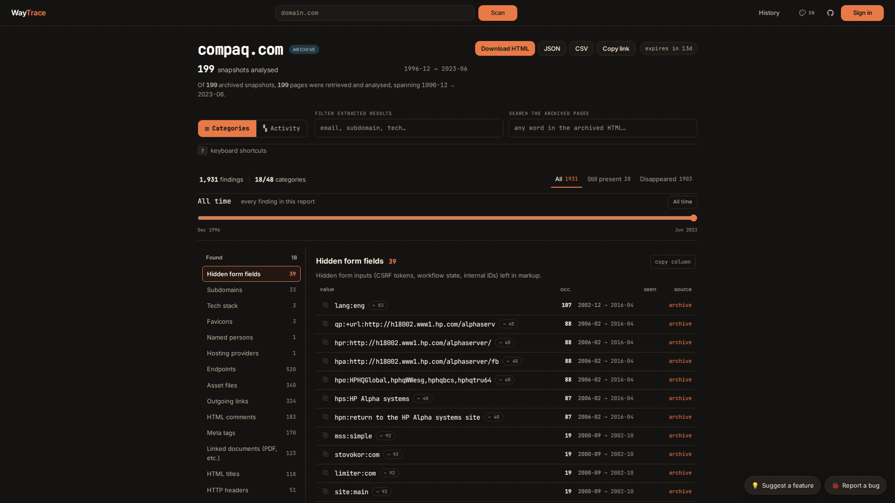
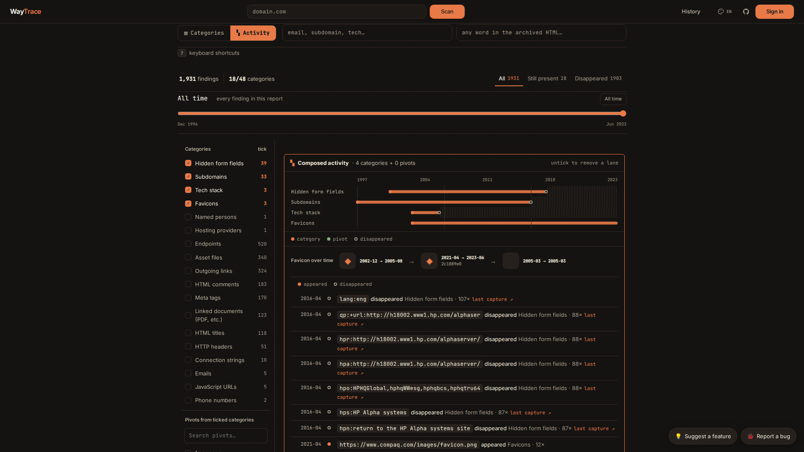

# WayTrace

**English** · [Français](README.fr.md)

Reconstruct what a domain published, and then deleted, from the pages the
Wayback Machine kept. 48 categories of findings, each dated with the month it
first appeared and the month it was last seen.

**No API key. No traffic to the target.** Every byte comes from archive.org.

[](https://waytrace.org)
[](https://github.com/thomashousset/WayTrace/actions/workflows/ci.yml)




<sub>Taken on waytrace.org. The two floating buttons bottom right are hosted-only
and are not in the self-hosted build.</sub>

## What a finding looks like

A real scan of `compaq.com`, a company absorbed into HP in 2002. 199 archived pages read,
1931 findings, 28 of them still present in the most recent snapshot.

```json
{
  "path": "/alphaserver/site_index.html",
  "first_seen": "2001-04",
  "last_seen": "2016-04",
  "occurrences": 97,
  "source_url": "https://web.archive.org/web/20010405141733/http://www.compaq.com:80/..."
}
```

```json
{
  "value": "openvms.compaq.com",
  "first_seen": "2000-06",
  "last_seen": "2009-10",
  "occurrences": 60,
  "source": "html",
  "source_url": "https://web.archive.org/web/20000620181347/http://www.compaq.com:80/..."
}
```

Every finding carries the archived page it came from, so any claim can be
opened and checked. Nothing is inferred.

## Quick start

```bash
git clone https://github.com/thomashousset/WayTrace && cd WayTrace
cp .env.example .env
docker compose up -d          # http://localhost:8000
```

Without Docker:

```bash
cd backend
python3 -m venv .venv && source .venv/bin/activate
pip install -r requirements.txt
cp ../.env.example ../.env
uvicorn main:app --reload     # http://localhost:8000
```

Hot reload in Docker: `docker compose -f docker-compose.dev.yml up`.

Hosted at [waytrace.org](https://waytrace.org) if you would rather not install
anything. The self-hosted build has no accounts, no per-scan snapshot ceiling,
and a Settings page for every scan and archive.org option.

## Usage

Open `http://localhost:8000`, type a domain, press Scan. Press Enter instead
to pick subdomains, a date range and a snapshot density before launching.

Or drive it over HTTP:

```bash
# What is in the archive, without scraping anything
curl -X POST localhost:8000/api/scan/preflight \
     -H 'Content-Type: application/json' \
     -d '{"domain":"example.com"}'

# Run a scan
curl -X POST localhost:8000/api/scan \
     -H 'Content-Type: application/json' \
     -d '{"domain":"example.com","config":{"depth":"quick","cap":400}}'

# Poll it, then read the report
curl localhost:8000/api/s/<url_id>
```

Reports export as JSON, CSV, or a single self-contained HTML file that opens
offline with no server under it. Full endpoint reference: [docs/API.md](docs/API.md).

## What it extracts

48 categories. Everything carries `first_seen`, `last_seen` and `occurrences`.

| | |
|---|---|
| **Identity** (7) | `emails` `persons` `phones` `addresses` `organizations` `social_profiles` `github_repos` |
| **Infrastructure** (8) | `subdomains` `endpoints` `internal_ips` `hosting` `http_headers` `connection_strings` `directory_listings` `cdn_accounts` |
| **Secrets** (7) | `api_keys` `jwt_tokens` `cloud_buckets` `crypto_addresses` `pgp_keys` `verification_tags` `adsense_ids` |
| **Stack and SaaS** (8) | `technologies` `js_urls` `payment_processors` `support_chat` `email_marketing` `mobile_apps` `captcha_providers` `auth_providers` |
| **Tracking** (4) | `analytics_trackers` `analytics_ids` `cookie_consent` `rss_feeds` |
| **Org signals** (4) | `bug_bounty_programs` `job_boards` `status_pages` `french_business_ids` |
| **Content** (10) | `html_titles` `html_comments` `meta_info` `hidden_fields` `assets` `linked_documents` `outgoing_links` `iframe_sources` `favicons` `sitemaps_and_robots` |

The exact list is `ALL_CATEGORIES` in
[`backend/services/extractor/finalize.py`](backend/services/extractor/finalize.py).

Findings are ranked into four tiers: **LEAK** for exposure the owner did not
mean to publish, **PIVOT** for a lead worth chasing, **CONTEXT** for
background, **BACKGROUND** for everything listed but never highlighted.

## Reading a report



The Activity view puts categories on a shared time axis and marks the month
each value appeared and the month it stopped. **Still present** means a value
reached the most recent archived snapshot this scan looked at, which is not
the same as being live on the site today.

## How it works

```
1. cdx.py         ask archive.org's CDX index which HTML captures exist
2. filters.py     score paths by OSINT value, spread the pick across years,
                  drop captures whose digest is identical to one already taken
3. scraper.py     fetch the chosen pages, concurrency-capped, with an AIMD
                  governor that backs off when archive.org asks it to
4. extractor/     48 category modules, regex plus selectolax DOM parsing
```

FastAPI, SQLite, aiohttp, selectolax. No JavaScript framework and no build
step: the frontend is `index.html`, `app.js` and `styles.css`, served as they
are. More detail in [docs/ARCHITECTURE.md](docs/ARCHITECTURE.md).

## Configuration

Everything lives in `.env`. The ones worth knowing:

| Variable | In `.env.example` | What it does |
|---|---|---|
| `MAX_CONCURRENT_SCRAPES` | `4` | Per-scan request cap against archive.org |
| `ARCHIVE_GLOBAL_CONCURRENCY` | `3` | Process-wide ceiling shared by every running scan |
| `HOSTED_SNAPSHOT_CEILING` | `3000` | Per-scan snapshot ceiling. `0` disables it, which is what you want self-hosted |
| `SCAN_TIMEOUT_SECONDS` | `3600` | Longest a scan may run |
| `SCAN_RETENTION_DAYS` | `14` | How long a finished scan is kept |
| `DATABASE_URL` | unset | SQLite path. Unset, it lands at `waytrace.db` in the repository root |

Full list in [`.env.example`](.env.example).

## Tests

```bash
cd backend && python -m pytest tests/ -q
```

## Legal

WayTrace reads a public archive. It sends nothing to the domain you are
looking at, and it cannot see anything archive.org has not already published.
That does not make everything it surfaces free to use: archived pages can hold
personal data, and what you may do with that is governed by the law where you
are, not by this tool.

Use it on domains you own, or within a mandate, or on subjects where the
public interest is real. Do not use it to profile private individuals.

## Author

Built and maintained by [Thomas Housset](https://thomashousset.com/).

Bugs and ideas are welcome as issues. For anything security related, read
[SECURITY.md](SECURITY.md) first: testing waytrace.org itself is worth a word
beforehand, and the reasons are in there.

## License

MIT. See [LICENSE](LICENSE).
